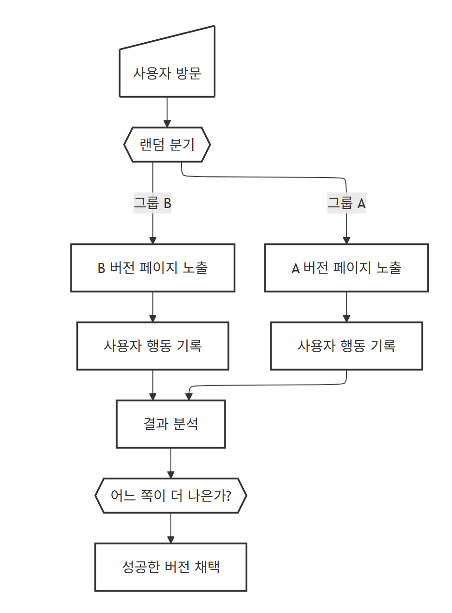
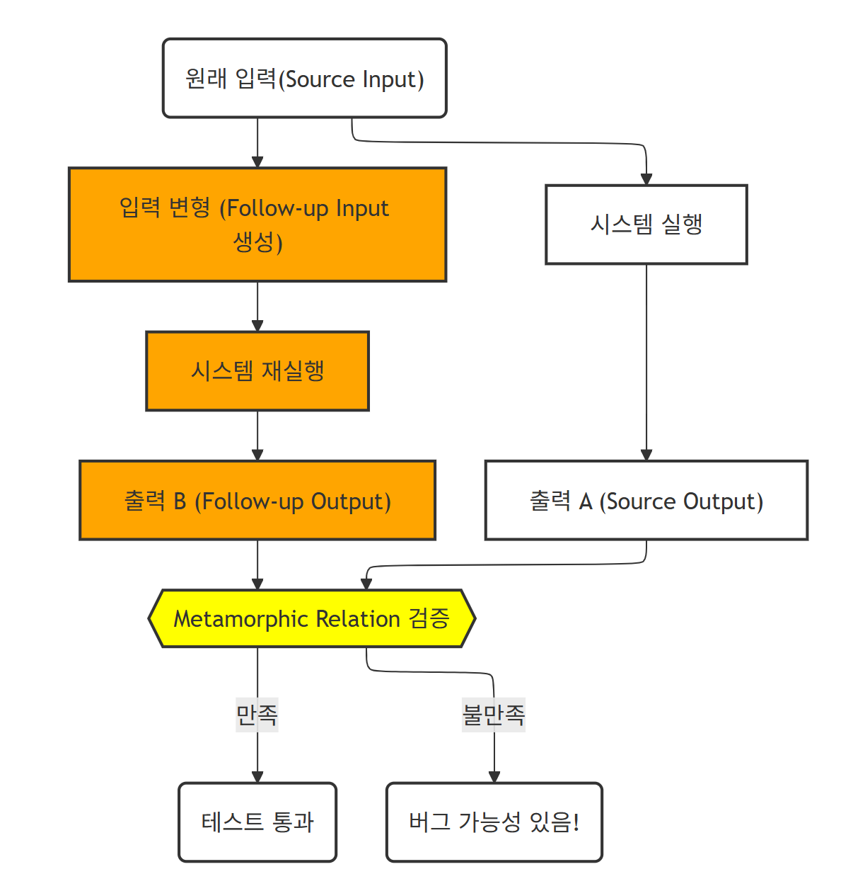

### AI기능을 대상으로 한 테스트 기법

AI가 도래하면서 당연하겠지만, 소프트웨어 테스트에도 많은 변화가 일어났습니다. 

기존의 테스트 설계 기법의 목적은 “사람이 생각치 못한 부분들을 기법을 통해 어느 정도 커버” 하기 위함이였습니다. 블랙박스 테스팅 에서의 결정 테이블, 상태 전이도, 화이트 박스에서의 MC/DC등이 그렇습니다. 

하지만 테스트 대상의 기능이 이제 AI가 필수로 들어갑니다. AI기능이 테스트 대상으로 되었을 때 가져야할 성질에는 두 가지가 있을 것 같습니다.

1. 정확성(Accuracy)

   출력 결과가 엉뚱하면 안된다

2. 항상성(Constancy)

   조건이 바뀌더라도 일관성있는 결과가 나와야 한다

이를 테스트하기 위해서는 어떤 기법들이 필요할까요? ISO29119 시리즈에서 제시하는 테스트 설계방법은 다음과 같다고 합니다.

1. 조합테스팅
2. 백투백 테스팅
3. AB테스팅
4. 변성 테스팅

#### 1. 조합 테스팅

우리가 생각하는 조합 테스팅이 맞습니다. (AI시대에도 이 기법은 살아남았군요.. 테스트 케이스 생성의 기본이라 그런 것 같습니다)각 조건별 나올 수 있는 경우의 수를 모두 조합하고 조건에 맞추어 걸러 케이스를 만들어 냅니다. 이를 효율적으로 갯수를 줄이는 방법인 페어와이즈 기법을 용하여 케이스를 만들 수도 있습니다. 

예를 들어 자율주행차 테스트에서는 도로, 기상, 교통 등 다양한 환경 조건과 자율주행 기능을 조합하여 시나리오를 구성해야 합니다. 센서 입력의 변화(예: 카메라 열화, GPS 정확도 저하)도 중요한 고려 요소 입니다. 안전이 중요한 AI 시스템에서는 기존의 페어와이즈 테스트보다 더 엄격한 조합 테스팅 기법이 필요합니다.

#### 2. 백투백 테스팅

[](https://mermaid.live/edit#pako:eNptkt9vmzAQx_8V66ZInUSiFEIM7lQtSvdQaX1Jt5fVe3DDERBgI2PUZIj_fbZDsqqa_OI7f-7X1zfAXmUIDPJave0LoQ35vuOSy9lsKGVpGBn4vzcO3s4wF31tdigz1KidlwPWFYdxJONsxuW-Fl33gDmZUJKXdc2kkhh0RqsK2acoiqb7_K3MTMHC9njnKrtzja-q6l0smYKd8Q7SmJ0he3HRnbG93nAw2JlH2fa2789XP5nP78nzqbt94bCRyhSoyZdXfb95dF6DDYffH9DQoZdnx_50g5MfNr2H3dl-HUhXiBYZKfAYkFq8Yu102aqmFVoYZXUio0NdcZuaw5PSSDZ704vaZZ1adUW3ngo99X-AuEx4Y6d0bZAddlZmO6cfdOs7R0LIVUzSOS3vLpbvwcplHRBAg7oRZWbXYODSBoFVpcHzv04_yIHL0aKiN-r5JPfAjO4xAK36QwEsF3Vnrb7NhMGHUhy0aC7I2fktK60GV7IV8pdSV8aawAY4AgtXySIOE0qj5TpZhmGaBnACdruOFjSN0-VqnaxiuqZjAH98guUiTilNV3EUUhonNLEB6Is9nVfbb3gAB-0mnMprv7tb1UtjS9LxL0twAbY)

기능적으로 동등한 시스템의 결과를 현재 테스트중인 시스템 테스트 결과와 비교하는 테스트를 의미합니다. 여기서 비교 대상 시스템은 완벽하게 똑같을 필요는 없습니다(구동환경, 요구사항 등이 다를 수 있습니다). 다만 두 시스템은 완전히 독립적이아야 합니다. 

#### 3. AB테스팅

A/B 테스팅은 종종 사용자 인터페이스 설계를 최적화하는 데 사용됩니다. 예를 들어, 사용자 인터페이스 설계자가 현재 빨간색인 ‘구매’ 버튼 색상을 파란색으로 변경하면 판매가 증가할 것이라는 가설을 세워 봅시다. 파란색 버튼으로 된 새로운 시스템은 다른 사용자에게 할당됩니다. 두 가지의 다른 버전에 대한 판매율을 비교하면서 통계적으로 유의미한 사용 횟수를 실행하면 가설이 올바른지 판단할 수 있습니다. 이 테스팅은 통계적으로 매우 많은 사용횟수가 필요합니다(1000회 이상이어야 유의미한 데이터가 나온다고 합니다).

[](https://mermaid.live/edit#pako:eNqFk8tu00AUhl9lNCg7J_Ilcc0gAbm1ZdENsCJmMcSTxKo9jpyx2mJZiopZgFToAipAaQUCCRV1kV4oQYIXykzeAXuS0AUS9Ww853z_73PmeGLYDhwCEex4wVa7h0MGHjZsCrKn7eHBoEE6wCEdHHkMdFzPQzSgRBmwMNgk6IZhGIv34pbrsB7S-9u3bJqv3KF6NwaDHu4TBHxMI-wVXdqPmAI8_IR4CNhQ7J6ID8fiaB_w8TE_mdgwAcXibVCLY3404ntfAL9Mp5Nxkswda1kWTH9M-OefoCrJeqsK-FkqPqZg9uqdOLwQX4eAP5-Iy9HjfzU1qWm0atdo6pJrtq7qmx284K_fg6wW_ulwQTUktXoN1ZTUWmt6Np6e_8obEukyt_qf3JrMrcexOLjgL_eB-PY7KxXwvTeA72ZVD6fj4Z3lwaxL-F5LpKfT8--zt6Nlg-I0nT3LLfNVKMQudRkCsX01cBvK_WLK9wl1SEjCPGpD4m1mI0lAUihABfok9LHrZH9LnH_VhqxHfDInF3Ib2jTJUByx4MEObUPEwogoMAyibg-iDvYG2S7qO5iRhou7Ifb_RvuYPgoCfymZQ03HZUG4jGUIRDHchkjXzZJl6qZmWtaKamq6pcAdiDTNKum6plesilrRyppuJgp8Kl3VkqWqlmWYRrlcVrWViq5AIt035ldA3gQFdsO8xUVNoTyOehBRBpGh3kz-ADP_QqM)

#### 4. 변성 테스팅

[](https://mermaid.live/edit#pako:eNplk09v2jAYxr-K5wkJpICSACHNpEmFAOuhmtTutGYHLzEQNcTIOOqfKBLSytRRDrtsqjRAm9Rulx3WVut62Cci4TsscWBlXU72-_6ex49j24cmsTDUYMshB2YHUQZe6IYL4s90UL-v4xawcAt5DgMt23E0l7hY6DNK9rH2uFgsLsf5A9tiHU3uHT55oKbYSpWEIreNH3RfOx5O20fYiSOk7c2sAaNP78PZOYhmw_DzZXaXeNTEYMvteSxnwBzI55-C6l50NolGF4vhBERnF4uP716l-ipv1_Zil9tJLAebYOXw3GOpRYwuF-OwnsB8LRDeDBbnH0C2QZJEea-XLguiN9Po5CqVJkKdC-vrIWbf_8lR50TjPkd13fX_KDXON31_GzPUJbTXsU2wgx3EbOKC-fUg-joNgpRtpOxK2oynIPw2jr5c8caz7GI4TmKN7sDi7c_5ze_cOnh7usZuZcPrk_mvOzD_MQhHl_Em452cRtPxo1xizw8L6EJdaCSnuSo0BX56CZHJ-LZrMw34xv1FMiCfL2_PDnYtTDFNqgbEzr4BgwAEmUyihwLsYtpFthXfRD_JaUDWwV2c0ksLAxpuEKPIY2T3yDWhxqiHBUiJ1-5ArYWcfjzzehZiWLdRm6Lu32oPuS8J6a4kKVS3bEboqhYjUPPhIdRkWSmoiqxIiqpWREWSVQEeQU2S1IIsS3JZLYtlqSTJSiDAY-4qFlRRVNWiUhYrlY2KXJIEiLn7dvq8-CsTYJsmW1xmovyX1IjnMqiVNorBH1FoStQ)

정확하다고 판명된 소스(Source) 테스트 케이스에서 변성 테스트 케이스를 만들어 테스트를 합니다. 

* 사례 1: 단일 변성 관계를 사용해 여러 후속 테스트 케이스를 도출할 수 있습니다 (예, 음성을 텍스트로 변환하는 기능에 대한 변성 관계를 사용해 소리의 크기만 다른 같은 음성 파일을 입력함으로써 같은 텍스트를 기대 결과로 갖는 다수의 후속 테스트 케이스를 생성할 수 있다). 변성 관계가 공식적(또는 준공식적) 으로 기술되고 소스 테스트 케이스가 제공되는 경우 도메인 지식이 필요하므로 변성 관계 자동 생성은 어렵겠지만 후속 테스트 케이스 생성을 자동화할 수 있습니다. 
* 사례 2: 생활방식 매개변수 세트를 기반으로 개인의 기대 수명을 예측하는 테스트 항목이 가능합니다. 하루 흡연 10개피 등의 값을 포함한 다양한 테스트 입력값을 통해 소스 테스트 케이스를 수행하고 그 결과 기대수명이 58년이라는 결과값을 갖습니다. 변성 관계는 어떤 사람이 담배를 더 많이 피우게 되면 아마도 기대 수명이 줄어들 것(또는 증가하지 않을 것)이라고 명시합니다. 그러므로 하루 흡연량을 20개피로 늘린 것을 제외하고는 동일한 생활 방식 매개변수를 갖는 후속 테스트 케이스를 생성할 수 있습니다. 이 후속 테스트 케이스의 기대 결과(기대 수명)는 58년 보다 적거나 같은 값으로 설정 가능합니다.

주의할 점은 이는 AI를 활용한 기법이 아닌, AI 기능을 ‘대상으로’ 한 다는 것이다. 그런데 주위에는 이런 기법으로 테스트를 하는 조직을 보지는 못했다. 참고하기 바란다. 

