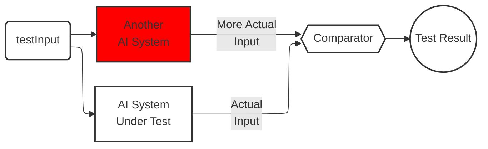

### 1. AI기능을 대상으로 한 테스트 기법

AI가 도래하면서 당연하겠지만, 소프트웨어 테스트에도 많은 변화가 일어났습니다. 

기존의 테스트 설계 기법의 목적은 “사람이 생각치 못한 부분들을 기법을 통해 어느 정도 커버” 하기 위함이였습니다. 블랙박스 테스팅 에서의 결정 테이블, 상태 전이도, 화이트 박스에서의 MC/DC등이 그렇습니다. 

하지만 테스트 대상의 기능이 이제 AI가 필수로 들어갑니다. AI기능이 테스트 대상으로 되었을 때 가져야할 성질에는 두 가지가 있을 것 같습니다.

1. 정확성(Accuracy)

   출력 결과가 엉뚱하면 안된다

2. 항상성(Constancy)

   조건이 바뀌더라도 일관성있는 결과가 나와야 한다

이를 테스트하기 위해서는 어떤 기법들이 필요할까요? ISO29119 시리즈에서 제시하는 테스트 설계방법은 다음과 같다고 합니다.

1. 조합테스팅
2. 백투백 테스팅
3. AB테스팅
4. 변성 테스팅

#### 1.1 조합 테스팅

우리가 생각하는 조합 테스팅이 맞습니다. (AI시대에도 이 기법은 살아남았군요.. 테스트 케이스 생성의 기본이라 그런 것 같습니다)각 조건별 나올 수 있는 경우의 수를 모두 조합하고 조건에 맞추어 걸러 케이스를 만들어 냅니다. 이를 효율적으로 갯수를 줄이는 방법인 페어와이즈 기법을 용하여 케이스를 만들 수도 있습니다. 

예를 들어 자율주행차 테스트에서는 도로, 기상, 교통 등 다양한 환경 조건과 자율주행 기능을 조합하여 시나리오를 구성해야 합니다. 센서 입력의 변화(예: 카메라 열화, GPS 정확도 저하)도 중요한 고려 요소 입니다. 안전이 중요한 AI 시스템에서는 기존의 페어와이즈 테스트보다 더 엄격한 조합 테스팅 기법이 필요합니다.

#### 1.2 백투백 테스팅

기능적으로 동등한 시스템의 결과를 현재 테스트중인 시스템 테스트 결과와 비교하는 테스트를 의미합니다. 여기서 비교 대상 시스템은 완벽하게 똑같을 필요는 없습니다(구동환경, 요구사항 등이 다를 수 있습니다). 다만 두 시스템은 완전히 독립적이아야 합니다. 

#### 1.3 AB테스팅

A/B 테스팅은 종종 사용자 인터페이스 설계를 최적화하는 데 사용됩니다. 예를 들어, 사용자 인터페이스 설계자가 현재 빨간색인 ‘구매’ 버튼 색상을 파란색으로 변경하면 판매가 증가할 것이라는 가설을 세워 봅시다. 파란색 버튼으로 된 새로운 시스템은 다른 사용자에게 할당됩니다. 두 가지의 다른 버전에 대한 판매율을 비교하면서 통계적으로 유의미한 사용 횟수를 실행하면 가설이 올바른지 판단할 수 있습니다. 이 테스팅은 통계적으로 매우 많은 사용횟수가 필요합니다(1000회 이상이어야 유의미한 데이터가 나온다고 합니다).

[](https://mermaid.live/edit#pako:eNqFk8tu00AUhl9lNCg7J_Ilcc0gAbm1ZdENsCJmMcSTxKo9jpyx2mJZiopZgFToAipAaQUCCRV1kV4oQYIXykzeAXuS0AUS9Ww853z_73PmeGLYDhwCEex4wVa7h0MGHjZsCrKn7eHBoEE6wCEdHHkMdFzPQzSgRBmwMNgk6IZhGIv34pbrsB7S-9u3bJqv3KF6NwaDHu4TBHxMI-wVXdqPmAI8_IR4CNhQ7J6ID8fiaB_w8TE_mdgwAcXibVCLY3404ntfAL9Mp5Nxkswda1kWTH9M-OefoCrJeqsK-FkqPqZg9uqdOLwQX4eAP5-Iy9HjfzU1qWm0atdo6pJrtq7qmx284K_fg6wW_ulwQTUktXoN1ZTUWmt6Np6e_8obEukyt_qf3JrMrcexOLjgL_eB-PY7KxXwvTeA72ZVD6fj4Z3lwaxL-F5LpKfT8--zt6Nlg-I0nT3LLfNVKMQudRkCsX01cBvK_WLK9wl1SEjCPGpD4m1mI0lAUihABfok9LHrZH9LnH_VhqxHfDInF3Ib2jTJUByx4MEObUPEwogoMAyibg-iDvYG2S7qO5iRhou7Ifb_RvuYPgoCfymZQ03HZUG4jGUIRDHchkjXzZJl6qZmWtaKamq6pcAdiDTNKum6plesilrRyppuJgp8Kl3VkqWqlmWYRrlcVrWViq5AIt035ldA3gQFdsO8xUVNoTyOehBRBpGh3kz-ADP_QqM)

#### 1.4 변성 테스팅

[](https://mermaid.live/edit#pako:eNplk09v2jAYxr-K5wkJpICSACHNpEmFAOuhmtTutGYHLzEQNcTIOOqfKBLSytRRDrtsqjRAm9Rulx3WVut62Cci4TsscWBlXU72-_6ex49j24cmsTDUYMshB2YHUQZe6IYL4s90UL-v4xawcAt5DgMt23E0l7hY6DNK9rH2uFgsLsf5A9tiHU3uHT55oKbYSpWEIreNH3RfOx5O20fYiSOk7c2sAaNP78PZOYhmw_DzZXaXeNTEYMvteSxnwBzI55-C6l50NolGF4vhBERnF4uP716l-ipv1_Zil9tJLAebYOXw3GOpRYwuF-OwnsB8LRDeDBbnH0C2QZJEea-XLguiN9Po5CqVJkKdC-vrIWbf_8lR50TjPkd13fX_KDXON31_GzPUJbTXsU2wgx3EbOKC-fUg-joNgpRtpOxK2oynIPw2jr5c8caz7GI4TmKN7sDi7c_5ze_cOnh7usZuZcPrk_mvOzD_MQhHl_Em452cRtPxo1xizw8L6EJdaCSnuSo0BX56CZHJ-LZrMw34xv1FMiCfL2_PDnYtTDFNqgbEzr4BgwAEmUyihwLsYtpFthXfRD_JaUDWwV2c0ksLAxpuEKPIY2T3yDWhxqiHBUiJ1-5ArYWcfjzzehZiWLdRm6Lu32oPuS8J6a4kKVS3bEboqhYjUPPhIdRkWSmoiqxIiqpWREWSVQEeQU2S1IIsS3JZLYtlqSTJSiDAY-4qFlRRVNWiUhYrlY2KXJIEiLn7dvq8-CsTYJsmW1xmovyX1IjnMqiVNorBH1FoStQ)

이렇게 됩니ㅏㄷ.
