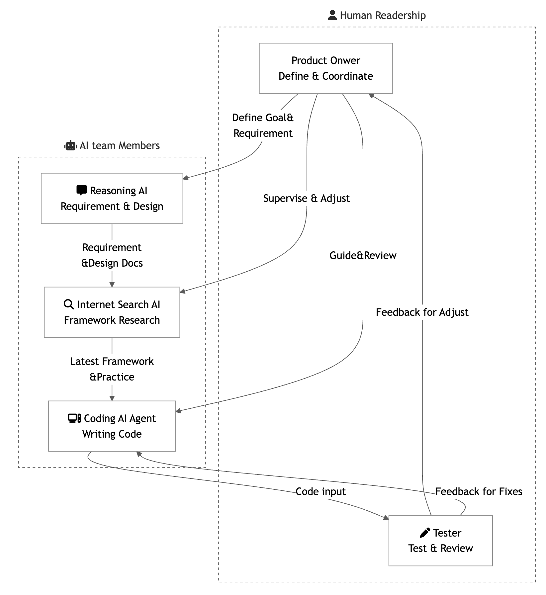
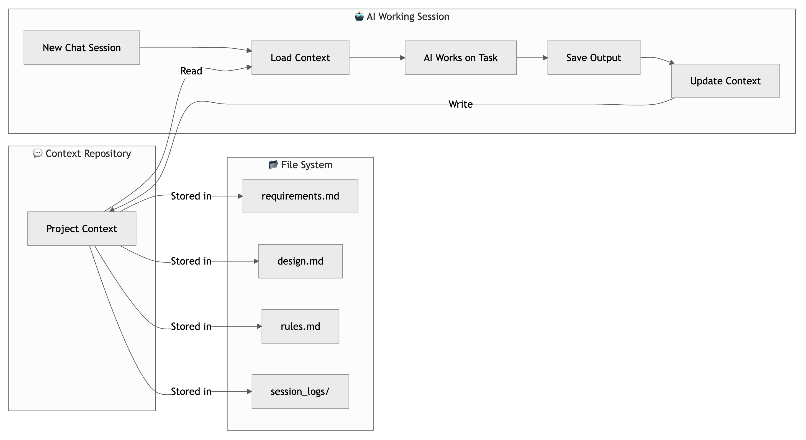

간만에 LY(Line Yahoo)의 기술 블로그를 보는데 흥미로운 내용이 있어서 잠깐 소개를 하려 한다. 

[AIコーディング：「Vibe Coding」からプロフェッショナルへ](https://techblog.lycorp.co.jp/ja/20250626a)

기본 아이디어는 AI를 하나의 팀 멤버로 보고 업무를 진행하는 것이다. 여러분은 프로젝트의 매니저이고 팀원에게 일을 시키려면, 명확한 지시가 있어야 하고 아웃풋에 대해 정확한 피드백을 해 주어야 한다. AI도 마찬가지이다. 명확하게 테스크를 끊어서 줘야 하고 아웃풋을 알려주며 이에 대해 잘못된 부분이 있으면 이야기해 줘야 한다. 

제시하는 전체 프로세스는 다음과 같다

여러분들은 Human Readership 부분을 담당하고 있다. AI라는 팀원들에게 일을 시키는데 여기서는 3단계로 테스크를 나누어 시킨다. 

* Reasoning AI : 요구사항과 설계를 담당한다
* Internet Search AI : 적절한 프레임워크 등을 검색한다.
* Coding AI Agent : 앞의 결과들을 참조해 코딩을 한다.

각 테스크 별로 특화된 AI를 선정하여 일을 하도록 한다.

재미있는 부분은 각 태스크 별 결과를 ‘콘텍스트’ 라 부르며 이를 별도의 레포지토리에 분리해 관리하도록 한 점이다.

파일 시스템으로 리포지토리를 구축하였지만, 향후 이는 NoSQL등으로 대체는 할 수 있을 것 같다. 

이 아이디어를 보고 좀 놀랬다. 나도 이전에 이와 비슷한 생각을 한 적이 있어서였다. 물론 이정도까지 구체적이지는 못했다.  내가 생각한 것은, 앞으로 사람은 AI를 하나의 부하직원처럼 생각해야 하고, 코딩 등의 업무는 AI에게 맡긴다. 그럼 사람이 중점적으로 해야 할 일은 다음 두 가지 정도 일 것이다.

* AI의 결과물에 문제는 없는지 봐야 한다. 내 목적에 맞는 결과물인지 체크하고 오류도 체크해야 한다
* 전체 업무 프로세스를 잡아줘야 한다. 여기에는 전체의 방향성, 무엇을 위해 이 프로젝트를 하는가를 잡아주는 것도 포함된다. 

이 블로그의 글을 읽어보니 나만 이런 생각을 한 것은 아니었다는게 놀라웠다.  AI시대에 개발자가 연차가 쌓일 때, 이제 프로젝트 관리 및 애자일 관련 지식은 싫다고 피할 게 아닌, 必須不可欠한 것이 되지 않을까 하는 생각도 들었다.  이를 위해 BVSSH를 미리 공부한 것이 어쩌면 다행일 까?

