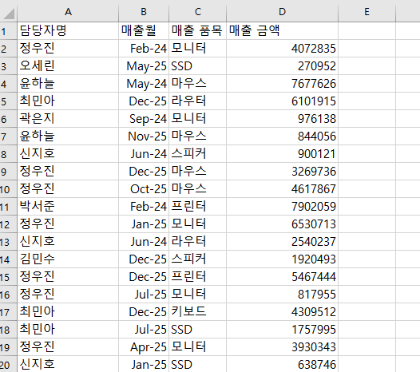
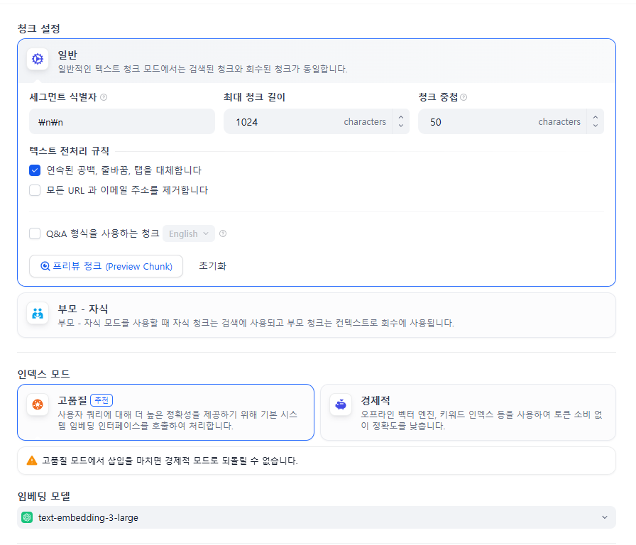
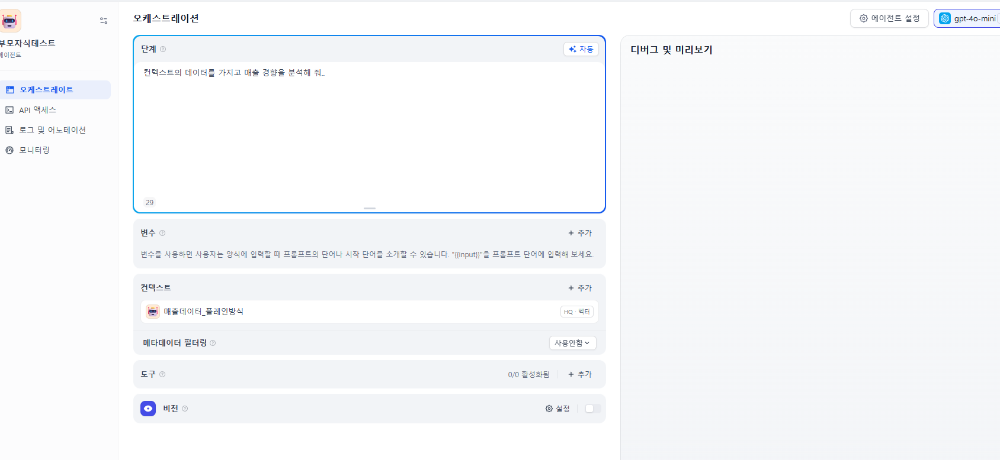
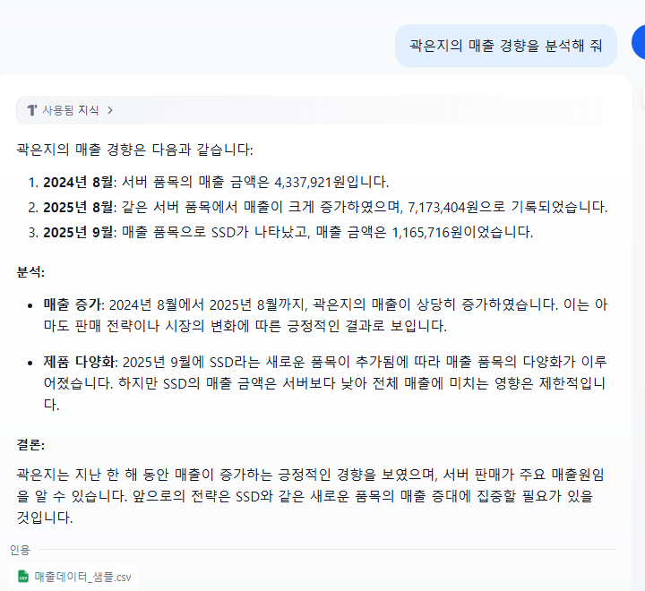
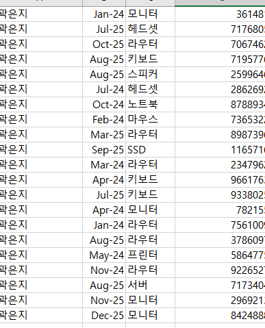
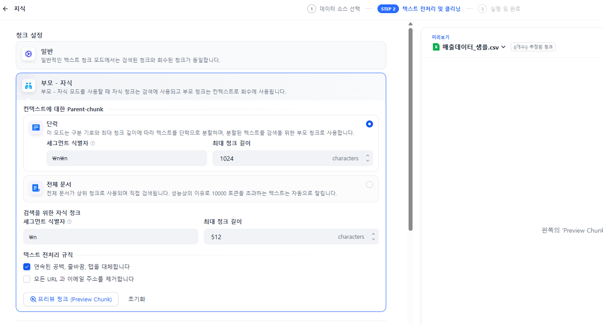
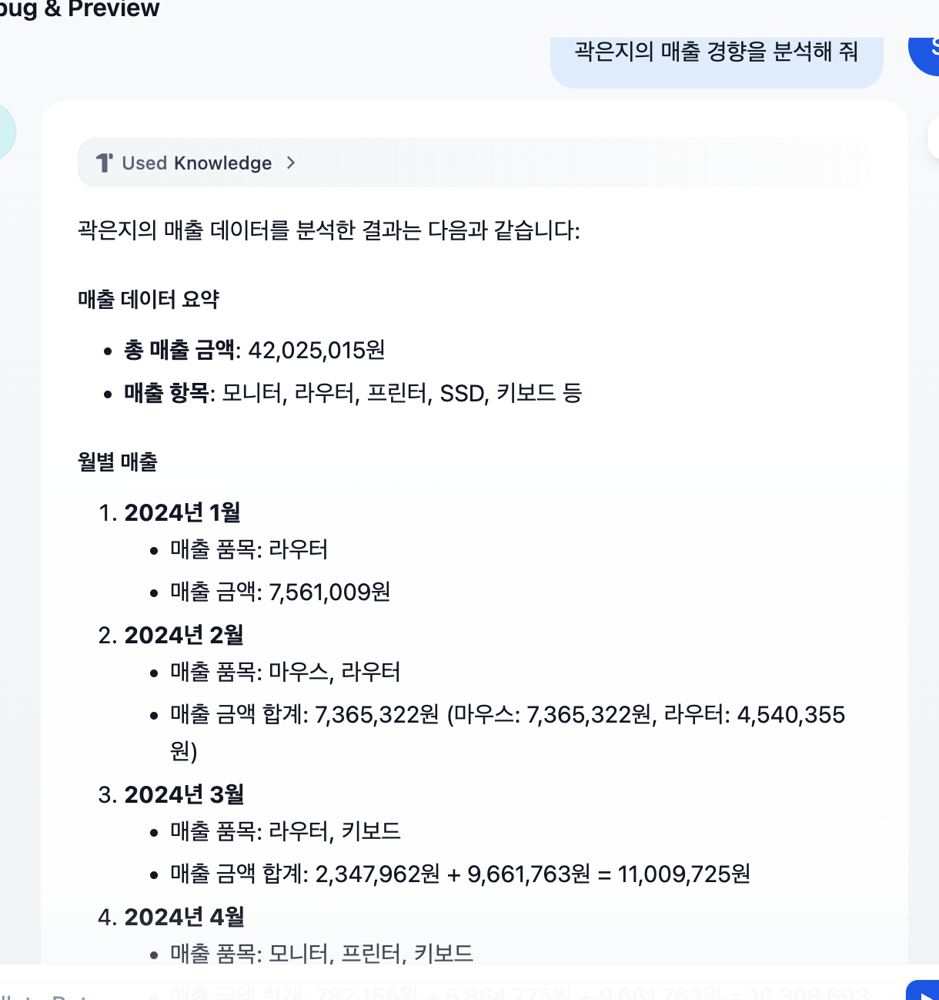

Dify 에서는 RAG를 위해 ‘지식’ 등록을 지원합니다. 텍스트 파일, 오피스파일, pdf, 등을 업로드하면 이를 읽어들여 벡터데이터베이스에 저장하고 검색을 지원 합니다.

하지만 특정 상황에서 벡터 검색에 대한 정확도 문제점이 있습니다. 특히 데이터가 트리 형태와 같은 계층화 구조일 때 검색 결과의 정확도가 많이 떨어지는 경향이 있습니다. 

다음과 같은 영업팀 인원별 매출 데이터가 있다고 합시다. 데이터는 전부 300 라인이며 2024-2025년도 매출 성적을 보여줍니다.

 

이를 이전 방법으로 ‘지식’ 을 ‘일반’ 으로 등록하고 검색을 해 보도록 하겠습니다. 지식의 등록화면은 다음과 같습니다. 

일반으로 옵션을 주었습니다. 그냥 캐리지리턴 2회(\n\n)를 청크(덩어리)로 구분하는 것입니다.

일반 옵션으로 벡터 데이터베이스화를 한 다음에 이 데이터베이스로 간단한 검색 Dify앱을 만들어 보겠습니다. 

Dify앱 만들기에서 ‘빈 상태로 시작’ → ‘에이전트’ 를 선택합니다.

여기에서 다음과 같이 설정합니다. 컨텍스트 부분에서 아까 위에서 만든 매출데이터 지식을 선택해 줍니다. 

LLM은 디폴트로 선택되는 gpt4가 300라인을 처리를 못한다는 오류가 떠서 gpt4o-mini 로 바꾸었습니다. 

옆 창의 ‘디버그 및 미리보기’ 에서 테스트를 해봅시다

곽은지 사원의 매출 분석이 서버와 SSD만 나왔습니다. 다른 것은 없을 까요? 원본 데이터를 보니까 곽은지 사원은 모니터, 헤드셋 등 많은 매출을 올렸지만 이 벡터 데이터베이스 상에서는 서버와 SSD만 분석합니다. 자기 편한 것만 가져오는 것 같습니다. 

이의 문제들을 완화하기 위해 부모-자식 구조를 도입하였습니다.  얕은 트리 구조로 생각하면 이해하기 쉬울 것 같습니다. 

지식 등록시 ‘부모-자식’ 을 선택하면 다음과 같은 옵션이 나옵니다. 

Parent-chunk 라는 것은 루트 노드를 의미합니다. 루트 노드를 여러개 둘 경우는 ‘단락’ 을 선택합니다. 루트와 루트간의 구분자는 디폴트로 캐리지 리턴 2개(\n\n)로 되어 있습니다. 위 매출 데이터는 루트가 나뉘어 있지 않으므로 문서 전체를 하나의 루트로 볼 수 있겠습니다. 이런 경우 ‘전체 문서’를 선택합니다(저는 전체문서를 선택했습니다). 

자식 청크는 캐리지 리턴 1개(\n)으로 구분되어 있으며, 위 CSV파일이 각 데이터가 이와 같이 구분 되어 있으므로 그대로 둡니다. URL및 이메일 주소도 문제는 없어 전처리 규칙도 그대로 놔 둡니다. 

그대로 등록을 마치고 아까 Dify애플리케이션에서 컨텍스트를 위에서 만든 것으로 변경하여 동일한 질문을 해 보도록 하겠습니다. 

분석 내용이 상당히 정확해 졌음을 알 수 있습니다. 라우터, 마우스, 모니터, 키보드 등 품목이 현실화 되었고 월별 매출도 정확해 졌습니다. 

이 부모-자식 구조는 FAQ 등 질문에 대한 답, 그리고 위와같은 리스트형 데이터에 적합하다고 합니다. 이제 RAG데이터를 보면서 부모-자식 구조로 정리될 수 있는지에 대한 검토부터 해야 하겠습니다. 

